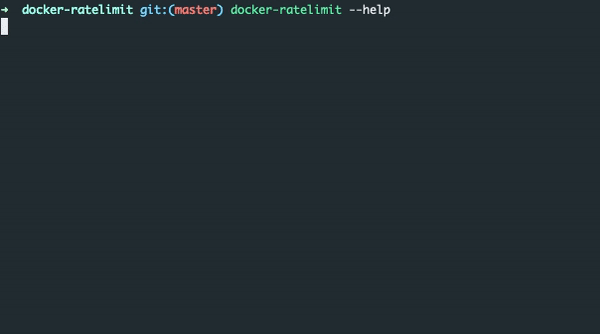

<div id="top"></div>
<!--
*** Thanks for checking out the Best-README-Template. If you have a suggestion
*** that would make this better, please fork the repo and create a pull request
*** or simply open an issue with the tag "enhancement".
*** Don't forget to give the project a star!
*** Thanks again! Now go create something AMAZING! :D
-->

<!-- PROJECT SHIELDS -->
<!--
*** I'm using markdown "reference style" links for readability.
*** Reference links are enclosed in brackets [ ] instead of parentheses ( ).
*** See the bottom of this document for the declaration of the reference variables
*** for contributors-url, forks-url, etc. This is an optional, concise syntax you may use.
*** https://www.markdownguide.org/basic-syntax/#reference-style-links
-->
[![Contributors][contributors-shield]][contributors-url]
[![Forks][forks-shield]][forks-url]
[![Stargazers][stars-shield]][stars-url]
[![Issues][issues-shield]][issues-url]
[![MIT License][license-shield]][license-url]
[![LinkedIn][linkedin-shield]][linkedin-url]

<br />
<div align="center">

  <h3 align="center">Docker rate limit</h3>

  <p align="center">
    A simple script to check your current docker pull rate limits
    <br />
    <a href="https://github.com/laertejjunior/docker-ratelimit"><strong>Explore the docs »</strong></a>
    <br />
    <br />
    <a href="https://github.com/laertejjunior/docker-ratelimit">View Demo</a>
    ·
    <a href="https://github.com/laertejjunior/docker-ratelimit/issues">Report Bug</a>
    ·
    <a href="https://github.com/laertejjunior/docker-ratelimit/issues">Request Feature</a>
  </p>
</div>

<!-- ABOUT THE PROJECT -->
## About The Project

### Built With

* [Node.js](https://nodejs.org/en/)

<p align="right">(<a href="#top">back to top</a>)</p>

<!-- GETTING STARTED -->
## Getting Started

### Prerequisites

* npm
  ```sh
  npm i npm@latest -g
  ```

### Installation

   ```sh
   npm i @laertejjunior/docker-ratelimit -g
   ```
<p align="right">(<a href="#top">back to top</a>)</p>

<!-- USAGE EXAMPLES -->
## Usage



<p align="right">(<a href="#top">back to top</a>)</p>

<!-- LICENSE -->
## License

[ISC](LICENSE.txt) © 2021, Laerte Mercier

<p align="right">(<a href="#top">back to top</a>)</p>

<!-- CONTACT -->
## Contact

Laerte Mercier - [@laertemercier](https://twitter.com/laertemercier) - laertejjunior@gmail.com

[https://github.com/laertejjunior/docker-ratelimit](https://github.com/laertejjunior/docker-ratelimit)

<p align="right">(<a href="#top">back to top</a>)</p>

<!-- MARKDOWN LINKS & IMAGES -->
<!-- https://www.markdownguide.org/basic-syntax/#reference-style-links -->
[contributors-shield]: https://img.shields.io/github/contributors/laertejjunior/docker-ratelimit.svg?style=for-the-badge
[contributors-url]: https://github.com/laertejjunior/docker-ratelimit/graphs/contributors
[forks-shield]: https://img.shields.io/github/forks/laertejjunior/docker-ratelimit.svg?style=for-the-badge
[forks-url]: https://github.com/laertejjunior/docker-ratelimit/network/members
[stars-shield]: https://img.shields.io/github/stars/laertejjunior/docker-ratelimit.svg?style=for-the-badge
[stars-url]: https://github.com/laertejjunior/docker-ratelimit/stargazers
[issues-shield]: https://img.shields.io/github/issues/laertejjunior/docker-ratelimit.svg?style=for-the-badge
[issues-url]: https://github.com/laertejjunior/docker-ratelimit/issues
[license-shield]: https://img.shields.io/github/license/laertejjunior/docker-ratelimit.svg?style=for-the-badge
[license-url]: https://github.com/laertejjunior/docker-ratelimit/blob/master/LICENSE.txt
[linkedin-shield]: https://img.shields.io/badge/-LinkedIn-black.svg?style=for-the-badge&logo=linkedin&colorB=555
[linkedin-url]: https://www.linkedin.com/in/laertejjunior
[product-screenshot]: images/screenshot.png